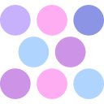
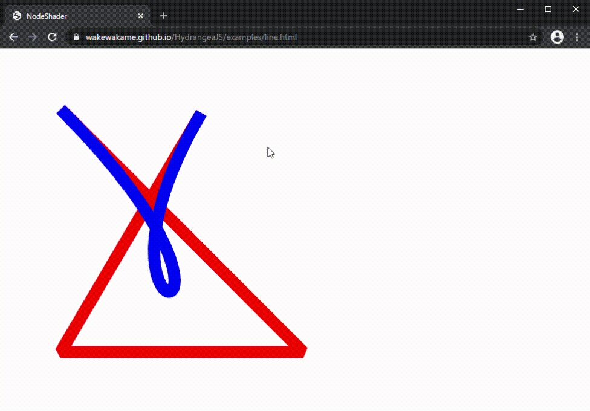

  



# HydrangeaJS
大学3年のころに作成した、WebGLを用いたUI作成ライブラリです。
ComponentクラスがUIパーツの基本単位であり、このクラスを継承してUIを設計するスタイルになっています。

# デモ

[https://wakewakame.github.com/HydrangeaJS/](https://wakewakame.github.com/HydrangeaJS/)

# ビルド

```bash
git clone https://github.com/wakewakame/HydrangeaJS
cd HydrangeaJS
git submodule update --init --recursive
npm install
npm run-script build
```

これにより`dst`ディレクトリに`main.js`が生成されます。

また、`npm run-script start`を実行した状態で`localhost:8080/dst`にアクセスするとプログラムが更新されるたびに自動的にブラウザがリロードしてくれます。

## License
MIT
